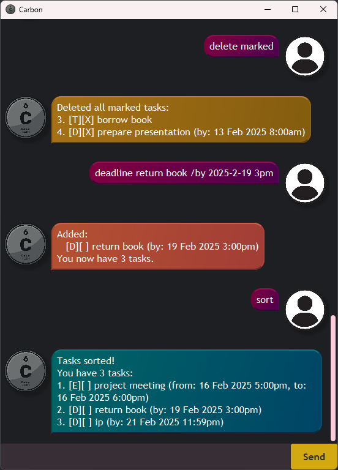

# Carbon User Guide



Carbon is an application that keeps track of your tasks.
It is easy to use, controlled entirely with text commands.

## Getting started

1. Ensure you have **Java 17** or above installed on your system.
2. Download the `.jar` file [here](https://github.com/samuelneo/ip/releases/latest).
3. Try double-clicking the file. In some cases, this is all that's required to launch the program.

   If the program doesn't launch, follow these steps:
   * Open a terminal.
   * Navigate to the folder where `carbon.jar` is located.
   * Run the following command and the application should launch:\
     ```java -jar carbon.jar```

## Command summary

_Commands_ are used to interact with Carbon. The following table is a summary of commands:

| Command                                                                     | Description                               |
|-----------------------------------------------------------------------------|-------------------------------------------|
| [`todo [description]`](#adding-a-todo)                                      | Adds a Todo task.                         |
| [`deadline [description] /by [date/time]`](#adding-a-deadline)              | Adds a Deadline task.                     |
| [`event [description] /from [date/time] /to [date/time]`](#adding-an-event) | Adds an Event task.                       |
| [`list`](#listing-your-tasks)                                               | Lists all tasks.                          |
| [`find [text]`](#finding-tasks)                                             | Lists all tasks containing `[text]`.      |
| [`mark [number]`](#marking-tasks-as-done)                                   | Marks task `[number]` as done.            |
| [`unmark [number]`](#marking-tasks-as-done)                                 | Marks task `[number]` as not done.        |
| [`delete [number]`](#deleting-tasks)                                        | Deletes task `[number]`.                  |
| [`delete marked`](#deleting-tasks)                                          | Deletes all marked tasks.                 |
| [`sort`](#sorting-tasks)                                                    | Sorts tasks by their specified date/time. |
| [`help`](#displaying-the-help-message)                                      | Displays the help message.                |
| [`bye`](#closing-the-program)                                               | Quits the program.                        |

## Commands

### Adding tasks

There are three types of tasks: Todos, Deadlines, and Events.

#### Adding a Todo

A **Todo** is a task with a description and no date/time attached.
This should be used for tasks that don't have a due date/time or specific timeframe.

The `todo [description]` command adds a Todo with the specified description.

##### _Example:_

```
todo reply to email
```

##### _Expected output:_

> ```
> Added:
>    [T][ ] reply to email
> You now have 1 task.
> ```

#### Adding a Deadline

A **Deadline** is a task with a description and a due date/time.

The `deadline [description] /by [date/time]` command adds a Deadline with the specified description
and the specified due date/time. See [Specifying dates and/or times](#specifying-dates-andor-times)
for more information.

##### _Example:_

```
deadline return book /by 2025-02-19 3pm
```

##### _Expected output:_

> ```
> Added:
>    [D][ ] return book (by: 19 Feb 2025 3:00pm)
> You now have 2 tasks.
> ```

#### Adding an Event

An **Event** is a task with a description, a start date/time, and an end date/time.

The `event [description] /from [date/time] /to [date/time]` command adds an Event with the specified
description, the specified start date/time, and the specified end date/time.
See [Specifying dates and/or times](#specifying-dates-andor-times) for more information.

```
event project meeting /from 2025-02-16 5pm /to 2025-02-16 6pm
```

##### _Expected output:_

> ```
> Added:
>    [E][ ] project meeting (from: 16 Feb 2025 5:00pm, to: 16 Feb 2025 6:00pm)
> You now have 3 tasks.
> ```

#### Specifying dates and/or times

Deadlines and Events have corresponding dates and/or times attached to them.
A date, time, or datetime may be specified.

* If specifying a date, the format `YYYY-MM-DD` is recommended, though some other formats are accepted too.
* If specifying a time, the format `HH24:MI` (hour in 24-hour format) is recommended, though some other
formats are accepted too.
  * In particular, if the minute portion is `00`, specifying the hour in 12-hour format followed by `am`/`pm`
is acceptable. For example, `15:00` and `3pm` are both recorded as the same value.
* If specifying a datetime, the format `YYYY-MM-DD HH24:MI` is recommended. The shortcut above can be used too,
so a datetime such as `2025-02-13 3pm` is acceptable.

If the text entered cannot be parsed into one of the above categories, a warning will be included in Carbon's
response message and the date/time will be stored as plain text. Commands such as [`sort`](#sorting-tasks)
will treat these tasks as if they had no specified date/time.

### Listing your tasks

The `list` command lists all your tasks.

##### _Example:_

```
list
```

##### _Expected output:_

> ```
> You have 3 tasks:
> 1. [T][ ] reply to email
> 2. [D][ ] return book (by: 19 Feb 2025 3:00pm)
> 3. [E][ ] project meeting (from: 16 Feb 2025 5:00pm, to: 16 Feb 2025 6:00pm)
> ```

### Finding tasks

The `find [text]` command lists all tasks containing `[text]`.

##### _Example:_

```
find meeting
```

##### _Expected output:_

> ```
> 1 task contains "meeting":
> 3. [E][ ] project meeting (from: 16 Feb 2025 5:00pm, to: 16 Feb 2025 6:00pm)
> ```

**Note:**
The event found in the above example is labelled as task 3, since it is the third task in the full task list.
This index is used (instead of the index as it appears in the search results) to ensure consistency.
The user can then interact with the task easily (for example, they can follow this command with
`mark 3` or `delete 3`).

### Marking tasks as done

The `mark [number]` command marks the task with the corresponding index as done.

##### _Example:_

```
mark 3
```

##### _Expected output:_

> ```
> Nice! Marked as done:
>    [E][X] project meeting (from: 16 Feb 2025 5:00pm, to: 16 Feb 2025 6:00pm)
> ```

**Note:** The `[X]` in the task label indicates that the task is marked as done.

Similarly, the `unmark [number]` command marks the task with the corresponding index as not done.

##### _Example:_

```
unmark 3
```

##### _Expected output:_

> ```
> Marked as not done:
>    [E][ ] project meeting (from: 16 Feb 2025 5:00pm, to: 16 Feb 2025 6:00pm)
> ```

### Deleting tasks

The `delete [number]` command deletes the task with the corresponding index.

##### _Example:_

```
delete 1
```

##### _Expected output:_

> ```
> Deleted the following task:
>    [T][ ] reply to email
> You now have 2 tasks.
> ```

The `delete marked` command deletes **all** tasks that are marked as done.

##### _Example:_

For this example, let's add a few tasks, mark them as done, then run `delete marked`:
```
todo borrow book
mark 3
deadline tutorial 3 /by 2025-02-20 9am
mark 4
delete marked
```

##### _Expected output:_

The code block below shows only the output for the `delete marked` command.
> ```
> Deleted all marked tasks:
> 3. [T][X] borrow book
> 4. [D][X] tutorial 3 (by: 20 Feb 2025 9:00am)
> ```

### Sorting tasks

The `sort` command sorts tasks in chronological order.

For this purpose,
* A Deadline is compared by its due date/time.
* An Event is compared by its start date/time.
* If a Deadline/Event only has a date specified (with no time), the time `00:00` (midnight)
in combination with the specified date is used for comparison.
* If a Deadline/Event only has a time specified (with no date), the current date as of running
the program will be used in combination with the specified time for comparison.
* Tasks with a specified date/time appear before tasks without.
  * As a result, Todos appear after any tasks that have a specified date/time.
  * If a Deadline or Event has their representative date/time stored as plain text, they will be treated
similarly to a Todo.

##### _Example:_

```
sort
```

##### _Expected output:_

> ```
> Tasks sorted!
> You have 2 tasks:
> 1. [E][ ] project meeting (from: 16 Feb 2025 5:00pm, to: 16 Feb 2025 6:00pm)
> 2. [D][ ] return book (by: 19 Feb 2025 3:00pm)
> ```

### Displaying the help message

The `help` command displays the list of commands, along with their brief descriptions.

### Closing the program

The `bye` command exits the program. Carbon will still remember your tasks,
and they'll be right there the next time you open the program.
